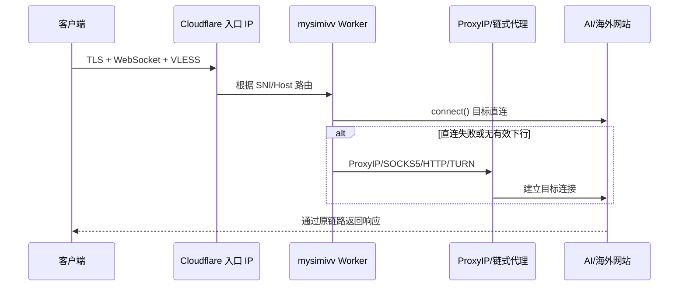
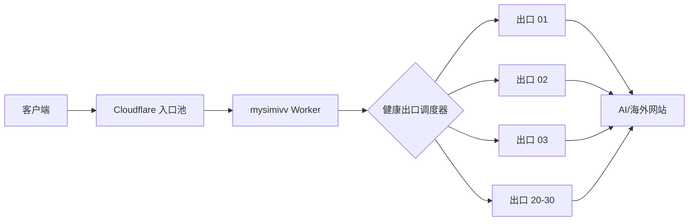

# EdgeTunnel 动态出口实现与验收记录

> **关键边界：** 当前生产已经具备 Cloudflare 平台自动分配的动态共享出口；它在不同观测时刻产生了 2 个和 6 个真实出口 IP，但尚未证明或保证同时存在 20–30 个唯一出口。20 个订阅地址是入口节点，不等于 20 个出口。

## 快速结论

当前生产链路：

```text
20 个稳定订阅入口
  -> Cloudflare Pages Worker
  -> 目标直连，失败时使用 ProxyIP/链式代理
  -> Cloudflare 平台选择共享动态出口
  -> AI/海外网站
```

已实现：

- 每 24 小时稳定生成 20 个入口 IP/端口组合。
- Clash/Mihomo 订阅包含自动选择、故障转移和负载均衡策略。
- Worker 支持 VLESS/WS/TLS 以及 SOCKS5、HTTP、HTTPS、TURN、SSTP 链式代理。
- Cloudflare 默认出站会动态变化；应用代码没有固定单一出口。
- `scripts/probe-ai-sites.py` 可通过真实 VLESS 隧道验证 AI/社交网站。
- `scripts/probe-egress-pool.py` 可通过真实 VLESS 隧道观测每个入口最终使用的公网出口 IP。

未实现或未证明：

- 无法通过普通 Pages/Workers API 指定或保证 20–30 个唯一源出口 IP。
- 入口节点与出口 IP 不是一对一、永久固定的关系。
- 当前后台 `IP节点` 维度记录的是订阅入口节点；不能把它解释为真实出口维度。
- “唯一真实出口至少 20 个”必须以出口探针的去重结果验收，而不能以订阅行数验收。

## 当前实现如何工作

### 生成稳定入口池

`_worker.js` 根据请求运营商组合 Cloudflare CIDR：

```text
中国移动 cmcc
中国联通 cu
中国电信 ct
Cloudflare 官方 cf
```

默认生成 20 个入口，覆盖以下 TLS 端口：

```text
443, 2053, 2083, 2087, 2096, 8443
```

节点使用服务域名作为 TLS SNI/Host，地址字段使用生成的 Cloudflare IP。节点地址和监控标识在同一个 24 小时窗口内保持一致，避免每次刷新都产生新的监控维度。

### 建立代理连接



普通请求先尝试目标直连；连接失败或触发已有回退逻辑时，使用 ProxyIP 或显式链式代理。最终公网源 IP 由实际出站链路决定。

### Cloudflare 动态出口来自哪里

当前代码没有以下能力：

```javascript
connect(target, { sourceIp: "指定出口" });
```

普通 Cloudflare Workers/Pages 的 `fetch()` 和 `connect()` 由平台选择共享出站地址。Worker Placement 可以影响代码执行位置，但不提供普通 Worker 的源出口 IP 选择接口：

- [Cloudflare Workers Placement](https://developers.cloudflare.com/workers/configuration/placement/)
- [Cloudflare Dynamic Workers egress control](https://developers.cloudflare.com/dynamic-workers/usage/egress-control/)

因此当前“动态出口”是 Cloudflare 平台行为，不是应用层实现的 20 路出口调度器。

## Live evidence

### 观测 A

对生产订阅的 20 个节点逐个执行：

```text
入口 TLS
-> WebSocket
-> VLESS
-> cloudflare.com:443
-> /cdn-cgi/trace
```

结果：

| 出口 IP | 国家 | colo | 关联入口数 |
|---|---|---|---:|
| `104.28.157.65` | US | SJC | 8 |
| `104.28.163.144` | US | SJC | 12 |

汇总：

```text
入口节点：20
成功观测：20
唯一出口：2
```

### 观测 B

在另一时间窗口重新运行已固化的出口探针：

| 出口 IP | 国家 | colo | 关联入口数 |
|---|---|---|---:|
| `104.28.152.126` | US | LAX | 3 |
| `104.28.152.151` | US | LAX | 5 |
| `104.28.158.227` | US | LAX | 1 |
| `104.28.158.91` | US | LAX | 1 |
| `104.28.165.132` | US | LAX | 6 |
| `104.28.165.56` | US | LAX | 4 |

汇总：

```text
入口节点：20
成功观测：20
唯一出口：6
失败：0
```

### Finding

Cloudflare 动态出口效果已经存在，且出口集合会随时间或平台调度变化：

```text
观测 A：2 个唯一出口，SJC
观测 B：6 个唯一出口，LAX
```

但出口数量和具体 IP 不受当前应用控制，不能将其记录为“已经实现 20–30 个出口”。

## 复现出口观测

运行：

```bash
python3 scripts/probe-egress-pool.py --nodes 20 --workers 6
```

输出包含：

```text
每个入口 IP/端口
实际出口 IP
国家
Cloudflare colo
探测耗时
出口去重分布
```

脚本不会输出订阅 Token 或 UUID。

以“至少 20 个唯一出口”为硬门槛运行：

```bash
python3 scripts/probe-egress-pool.py \
  --nodes 20 \
  --workers 6 \
  --minimum-unique 20
```

退出码：

```text
0 = 所有节点探测成功，且唯一出口达到阈值
1 = 节点探测失败，或唯一出口不足 20
```

## 复现 AI 兼容性

运行完整 AI/社交网站矩阵：

```bash
python3 scripts/probe-ai-sites.py --nodes 20 --workers 8
```

该脚本执行真实：

```text
Cloudflare 入口 TLS
-> WebSocket
-> VLESS
-> 目标 TLS
-> 目标 HTTP
```

判定：

```text
pass                 = 2xx/3xx
reachable_restricted = 4xx，网络/TLS可达但需要认证或触发站点限制
fail                 = TLS、隧道、超时或 5xx 等失败
```

## 目标方案：20–30 个真实出口

### 验收条件

```text
configured_routes >= 20
observed_unique_egress_ips >= 20
healthy_egress_ips >= 20
```

配置 30 条线路但探测到 8 个唯一公网 IP时，只能计为 8 个出口。

### 调度语义

```text
新会话：从健康出口池加权随机
同一 WebSocket/TCP：连接全生命周期固定出口
同一账号/设备：默认粘滞 30–60 分钟
出口故障：新连接切换到其他健康出口
连续失败：进入 cooldown
重复出口：自动合并或下线
```

不应按每个 HTTP 请求随机跨国家切换，因为这会破坏 ChatGPT、Claude 等账号会话一致性。

### 目标架构



真正受控的出口来源可以是 SOCKS5、HTTP CONNECT、HTTPS CONNECT、TURN、VPS 网关，或支持多个独立 sticky session 的动态代理服务。普通 Cloudflare 默认动态出口不能提供数量下限保证。

## 正确监控口径

当前后台 `IP节点` 是入口维度。真实出口维度必须来自 `probe-egress-pool.py` 或等价的真实隧道观测，并记录：

```text
egress_ip
country
colo
observed_at
freshness
associated_entry_nodes
```

出口监控应显示：

```text
请求趋势：总计 + 每个真实出口一条曲线
流量趋势：总计 + 每个真实出口一条曲线
表格：出口、地区、状态、流量、错误、最后观测
```

Cloudflare 默认出口可能变化，所以必须显示观测时间和新鲜度；不能把一次观测永久绑定为某入口的固定出口。

## Evidence → Finding → Path

| Evidence | Finding | Path |
|---|---|---|
| 20 个入口第一次观测得到 2 个出口 | 入口数量不等于出口数量 | 使用真实隧道 trace 去重，而非按订阅行计数 |
| 后续观测得到 6 个不同出口 | Cloudflare 默认出口确实动态变化 | 保留定时观测和 freshness，不宣称固定映射 |
| 两次观测均少于 20 个唯一出口 | 当前生产不满足 20–30 出口硬门槛 | 接入可控上游出口池或接受无数量保证的 Cloudflare 动态出口 |
| AI 兼容探针能通过真实 VLESS 链路执行 | 可对每个观测出口做 AI 兼容验收 | 出口入池前必须运行目标矩阵和健康检查 |
| Worker API没有源 IP选择参数 | 应用无法强制普通 Cloudflare 提供 20 个出口 | 调度器后面必须存在真实、可控的出口资源 |

## 当前生产快照

记录时的生产信息：

```text
Stable host: https://mysimivv.pages.dev
Production source: 1698b0a
Branch: cf
```

这是一份时间点证据。Cloudflare 默认出口集合会变化，必须通过探针刷新当前事实。
